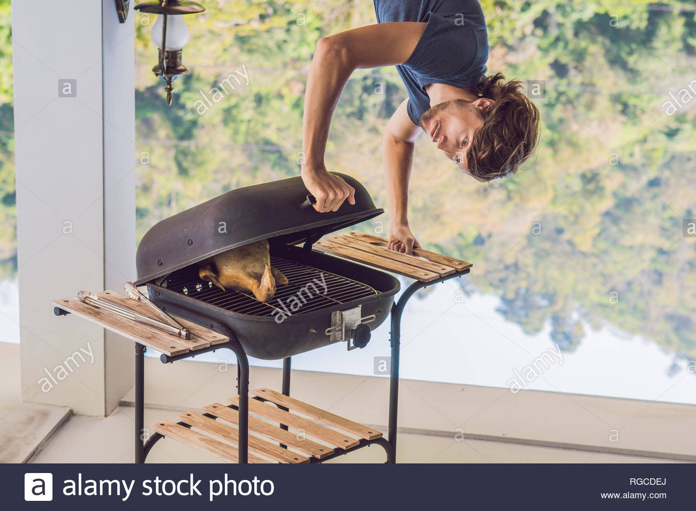

# Broiling

It turns out that Broiling is just grilling from above, a.k.a. upside-down grilling.

From Wikipedia:
> Grilling is a form of cooking that involves dry heat applied to the surface of food, commonly from above, below or from the side. Grilling usually involves a significant amount of direct, radiant heat, and tends to be used for cooking meat and vegetables quickly. Food to be grilled is cooked on a grill (an open wire grid such as a gridiron with a heat source above or below), using a cast iron/frying pan, or a grill pan (similar to a frying pan, but with raised ridges to mimic the wires of an open grill).
>
> Heat transfer to the food when using a grill is primarily through thermal radiation. Heat transfer when using a grill pan or griddle is by direct conduction. In the United States, when the heat source for grilling comes from above, grilling is called **broiling**. In this case, the pan that holds the food is called a broiler pan, and heat transfer is through thermal radiation.