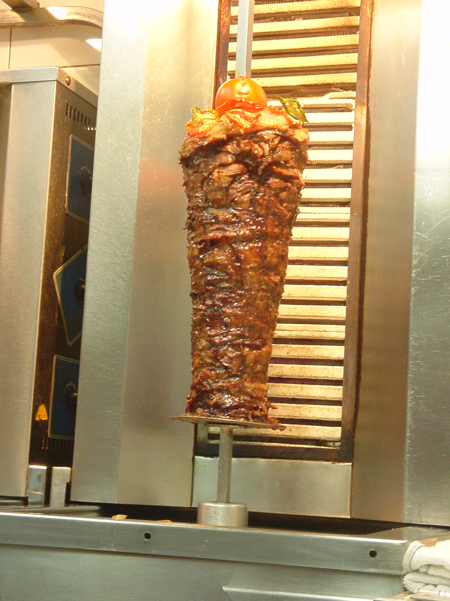

# Roasting

From Wikipedia:
> Roasting is a cooking method that uses dry heat where hot air covers the food, cooking it evenly on all sides with temperatures of at least 150 °C (300 °F) from an open flame, oven, or other heat source. Roasting can enhance the flavor through caramelization and Maillard browning on the surface of the food. Roasting uses indirect, diffused heat (as in an oven), and is suitable for slower cooking of meat in a larger, whole piece. Meats and most root and bulb vegetables can be roasted. Any piece of meat, especially red meat, that has been cooked in this fashion is called a roast. Meats and vegetables prepared in this way are described as "roasted", e.g., roasted chicken or roasted squash.