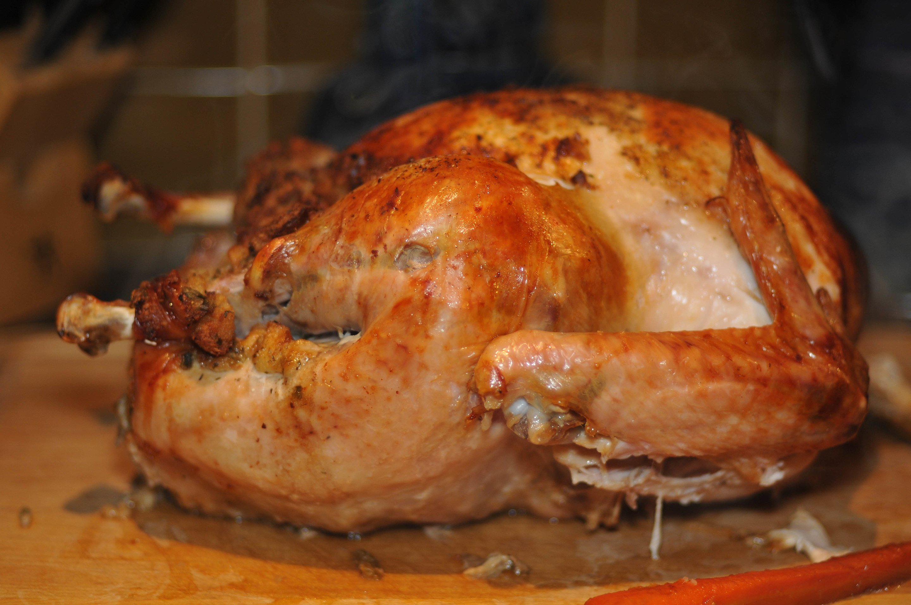

# Thanksgiving

From Wikipedia:
> The centerpiece of contemporary Thanksgiving in the United States and in Canada is a large meal, generally centered on a large roasted turkey. It is served with a variety of side dishes which vary from traditional dishes such as mashed potatoes, stuffing, and cranberry sauce, to ones that reflect regional or cultural heritage. The majority of the dishes in the traditional American version of Thanksgiving dinner are made from foods native to the New World, as according to tradition the Pilgrims received these foods, or learned how to grow them, from the Native Americans. Thanksgiving dinner is the largest eating event in the United States; people eat more on Thanksgiving than on any other day of the year.