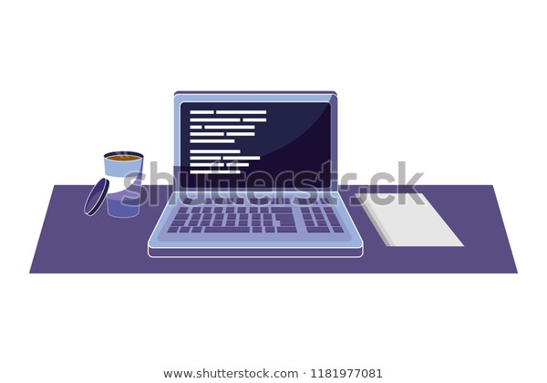

# VS Code Notes App Example

Welcome to the example repository for my ["DIY" Notes App with VS Code]() blog post! Please use this as a helpful reference for setting up your own notes repository.

## Subfolders

- [Personal](./Personal/README.md)
- [Work](./Work/README.md)